# Hello fellows 👋

- 👋 Hi, I'm Phil
- 👤 I'm a programming and military enthusiast passionate about expanding my horizons
- 💼 I'm currently going to school and practicing for my future career at the german armed forces
- 🌱 When outside, you'll find me hiking, climbing, and running in the mountains
- 📫 How to reach me:

&nbsp;&nbsp;&nbsp;&nbsp;&nbsp;&nbsp;[](https://theskz.dev#gh-light-mode-only)
[](https://theskz.dev#gh-dark-mode-only)
&nbsp;&nbsp;
[](https://theskz.dev/s/discord#gh-light-mode-only)
[](https://theskz.dev/s/discord#gh-dark-mode-only)
&nbsp;&nbsp;
[](https://theskz.dev/s/x#gh-light-mode-only)
[](https://theskz.dev/s/x#gh-dark-mode-only)
&nbsp;&nbsp;
[](https://theskz.dev/s/youtube#gh-light-mode-only)
[](https://theskz.dev/s/youtube#gh-dark-mode-only)
&nbsp;&nbsp;
[](https://theskz.dev/s/instagram#gh-light-mode-only)
[](https://theskz.dev/s/instagram#gh-dark-mode-only)
&nbsp;&nbsp;
[](https://theskz.dev/s/linkedin#gh-light-mode-only)
[](https://theskz.dev/s/linkedin#gh-dark-mode-only)
&nbsp;&nbsp;

&nbsp;&nbsp;&nbsp;&nbsp;&nbsp;&nbsp;

## Languages and Tools:




## 📊 Recent activity
<!--START_SECTION:waka-->

```txt
From: 27 April 2025 - To: 04 May 2025

Total Time: 8 hrs 43 mins

Python                             ⣿⣿⣿⣿⣿⣿⣿⣿⣿⣿⣿⣿⣿⣿⣿⣦⣀⣀⣀⣀⣀⣀⣀⣀⣀   61.76 %
SQL                                ⣿⣿⣿⣶⣀⣀⣀⣀⣀⣀⣀⣀⣀⣀⣀⣀⣀⣀⣀⣀⣀⣀⣀⣀⣀   14.40 %
YAML                               ⣿⣿⣀⣀⣀⣀⣀⣀⣀⣀⣀⣀⣀⣀⣀⣀⣀⣀⣀⣀⣀⣀⣀⣀⣀   08.16 %
```

<!--END_SECTION:waka-->

<!-- 
### My GitHub Stats

-->

<!--RECENT_ACTIVITY:start-->
1. ⬆️ Pushed 1 commit(s) to [philskillz-coder/philskillz-coder.github.io](https://github.com/philskillz-coder/philskillz-coder.github.io)<br>
2. ⬆️ Pushed 1 commit(s) to [philskillz-coder/philskillz-coder.github.io](https://github.com/philskillz-coder/philskillz-coder.github.io)<br>
3. ⬆️ Pushed 1 commit(s) to [philskillz-coder/philskillz-coder.github.io](https://github.com/philskillz-coder/philskillz-coder.github.io)<br>
4. ⬆️ Pushed 1 commit(s) to [philskillz-coder/philskillz-coder.github.io](https://github.com/philskillz-coder/philskillz-coder.github.io)<br>
5. ⬆️ Pushed 1 commit(s) to [philskillz-coder/philskillz-coder.github.io](https://github.com/philskillz-coder/philskillz-coder.github.io)<br>
<!--RECENT_ACTIVITY:end-->
